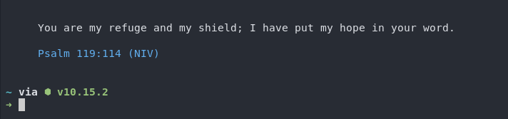

## Verse A Day

This is a small script that's run in your `~/.bashrc` to show a random bible verse
each time you open the terminal.

### Install

Simply copy and paste this in your terminal

    curl https://raw.githubusercontent.com/emelent/verse-a-day/master/install.sh | sh

### Manual Install

If you want to install it manually add the contents of the `bashrc` file
to your own `~/.bashrc`. This is best suited if you're using another shell
that is based on **bash**, you would add this to your shell's rc file, this would
be `~/.zshrc` for  **zsh**.

### Configuration

There isn't much configuration, but if instead you would like to have the script
display a single Bible verse each day instead of a random verse each time you
open a terminal then simply set `export BIBLE_DAILY_VERSE=1` in your `~/.bashrc`
after installation.

    export BIBLE_DAILY_VERSE=1
